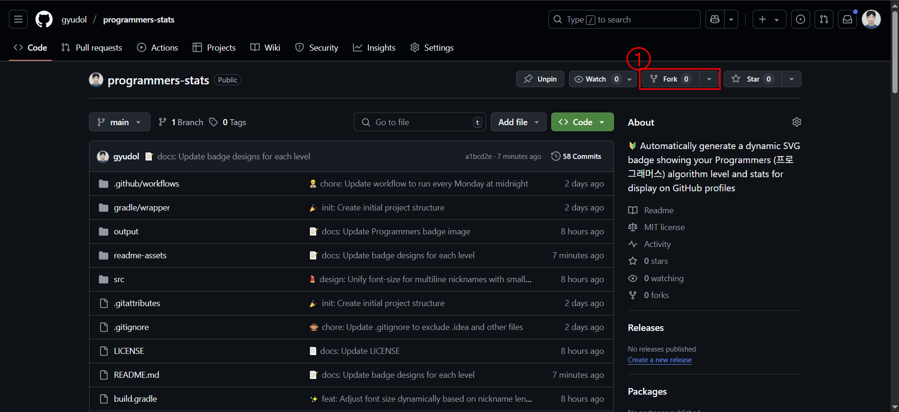
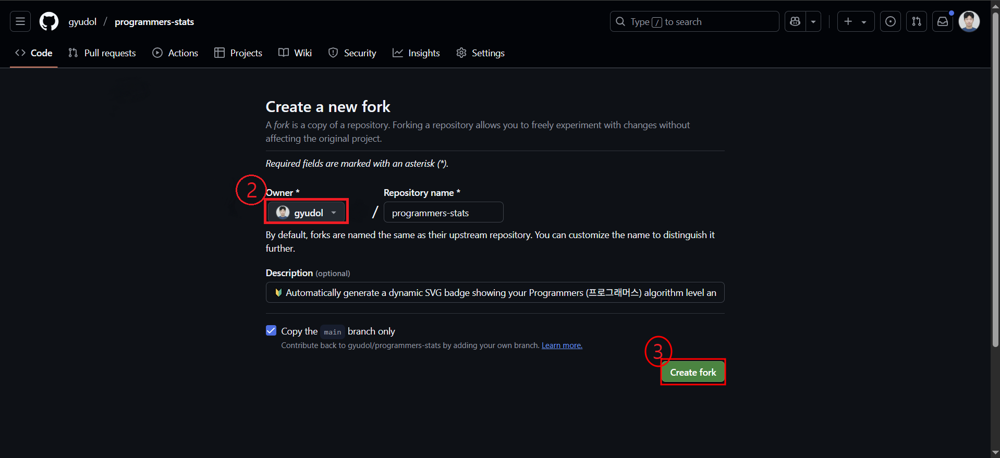
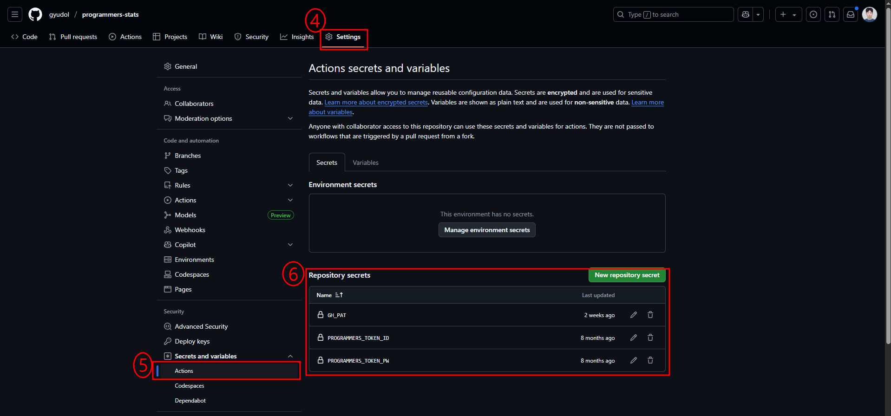
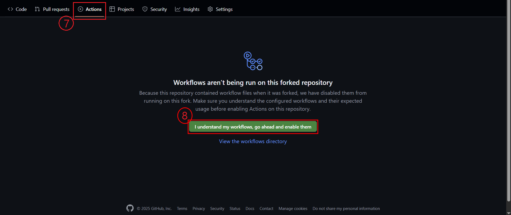
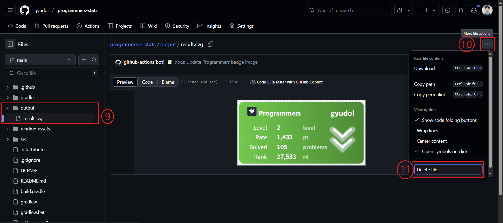
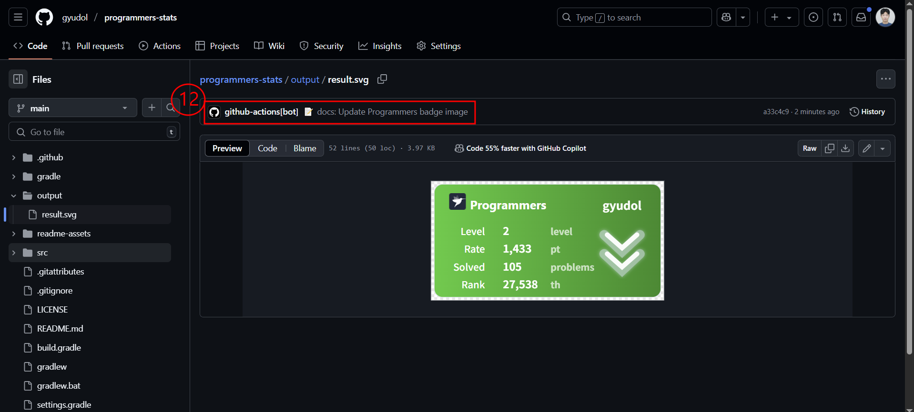
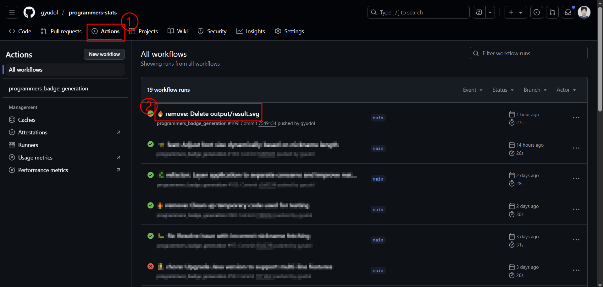
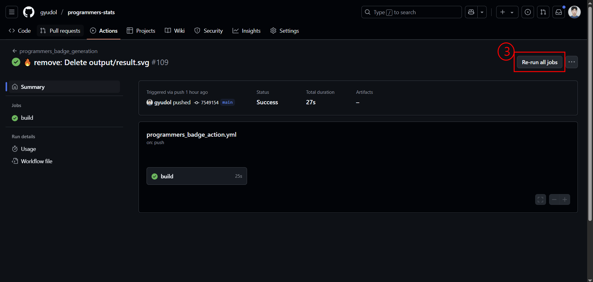

# 🔰 Programmers Stats

GitHub에서 **[프로그래머스](https://programmers.co.kr/) 문제 풀이 현황을 한눈에!** 자동 갱신되는 배지 생성 프로젝트 
프로그래머스에서 푼 문제 실적을 GitHub 프로필에 배지 형태로 시각화해줍니다. 배지는 **매주 자동으로 갱신**되며, 원버튼 수동 갱신도 지원합니다.  

## ♻️ 디자인 리빌딩 및 절차 간소화

[tomy8964/Programmers_Badge_Generator](https://github.com/tomy8964/Programmers_Badge_Generator?tab=readme-ov-file)를 기반으로 디자인을 새롭게 구성하고, 배지 생성 절차를 간소화하였습니다.

|                        이전 배지 디자인                         |                       현재 배지 디자인                        |
| :-------------------------------------------------------------: | :-----------------------------------------------------------: |
|  |  |

 

## 🌟 레벨 별 배지 디자인

|                          Lv1. Design                          |                          Lv2. Design                          |                          Lv3. Design                          |
| :-----------------------------------------------------------: | :-----------------------------------------------------------: | :-----------------------------------------------------------: |
|  |  |  |

|                          Lv4. Design                          |                          Lv5. Design                          |                          Challenger Design                           |
| :-----------------------------------------------------------: | :-----------------------------------------------------------: | :---------------------------------------------------------------------: |
|  |  |  |

> 💡 일부 숨겨진 도전과제를 달성하면 통계치가 금색으로 하이라이트됩니다.

 

## ⚙️ 프로젝트 설정

#### 1️⃣ 이 레포지토리를 포크합니다.

   🔍 View Detail

 
<table align="center">
<tr>
<td width="50%" align="center">
 </td>
<td width="50%" align="center">
 </td>
</tr>
</table>

#### 2️⃣ 포크한 레포지토리의 환경 변수를 등록합니다.

🔍 View Detail

 
<blockquote>⚠️ <strong>GitHub Personal Access Token 생성이 선행되어야 합니다!</strong>  
<a href="https://docs.github.com/ko/authentication/keeping-your-account-and-data-secure/managing-your-personal-access-tokens#personal-access-token-classic-만들기">🔗 Token 생성 방법 - 공식 문서</a></blockquote>  

<ul>
  <li>
    레포지토리 <strong>Settings > Secrets and variables > Actions</strong> 로 이동하여 아래 값을 등록합니다:
    <ul>
      <li><code>GH_PAT</code>: GitHub Personal Access Token</li>
      <li><code>PROGRAMMERS_TOKEN_ID</code>: 프로그래머스 계정 이메일</li>
      <li><code>PROGRAMMERS_TOKEN_PW</code>: 프로그래머스 계정 비밀번호</li>
    </ul>
  </li>
</ul>  

#### 3️⃣ `Actions` 탭으로 이동해 `enable` 버튼을 클릭합니다.

   🔍 View Detail

 

#### 4️⃣ output/result.svg 파일을 삭제합니다.

   🔍 View Detail

 

#### 5️⃣ 배지가 정상적으로 재생성되었는지 확인합니다.

   🔍 View Detail

 
<blockquote>
 ✅ Action이 완료된 후, 배지가 정상적으로 재생성되었는지 확인하세요.  
 (⏳ 약 <strong>10초 정도</strong> 소요될 수 있습니다.)   
 ⚠️ <strong>변경된 배지가 보이지 않는다면 브라우저를 새로고침(F5) 해보세요.</strong>  
 🔁 여전히 반영되지 않는다면, <a href="#project-setting-2">설정 2️⃣</a>로 돌아가 환경 변수를 다시 입력한 후 <a href="#manual-refresh">🔄 배지 수동 갱신</a> 항목을 참고해 수동으로 갱신을 진행해주세요.
</blockquote>
 
<li>아래 이미지와 같이 <strong>본인의 커밋 메시지와는 다른 커밋</strong>이 자동으로 생성되었다면,  
   배지가 성공적으로 재생성된 것입니다.</li>
<li>레포지토리의 <code>output</code> 폴더에 <code>result.svg</code> 파일이 재생성되어 있는지 확인하고,  
   자신의 프로그래머스 정보와 일치하는지 확인합니다. </li>  

#### 6️⃣ GitHub 프로필에 프로그래머스 배지를 등록합니다.

   🔍 View Detail

 
<li> GitHub 프로필에 해당하는 레포지토리의 <code>README.md</code> 파일에 다음 코드를 삽입하세요: </li>
<blockquote>⚠️ <strong><code>{your-github-id}</code></strong> 부분은 반드시 <strong>본인의 GitHub 사용자명</strong>으로 교체해야 합니다.</blockquote>  
   <pre><code></code></pre>

<strong>ex)</strong> GitHub 사용자명이 <code>gyudol</code>일 경우:

  <pre><code></code></pre>
  

   

## 🔄 배지 수동 갱신

배지를 수동으로 갱신하고 싶다면, 포크한 레포지토리의 **Actions** 탭으로 이동하여  
가장 최근에 실행된 워크플로우를 선택한 후 우측 상단의 **Re-run jobs** 버튼을 클릭하세요.

> ⚠️ 프로그래머스 통계에 변화가 없을 경우, 워크플로우가 실패로 표시되며 배지는 갱신되지 않습니다.

   🔍 View Detail

 
<table align="center">
<tr>
<td width="50%" align="center">
 </td>
<td width="50%" align="center">
 </td>
</tr>
</table>

